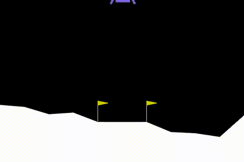
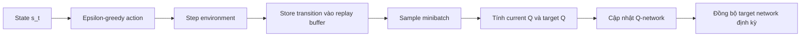

# Lunar Lander Với Deep Q-Network

<p align="center">
  Baseline Reinforcement Learning cho <code>LunarLander-v3</code> dùng <code>PyTorch</code> và <code>Gymnasium</code>
</p>

<p align="center">
  
  
  
</p>

## Tổng quan

Dự án này xây dựng một agent **Deep Q-Network (DQN)** để học cách hạ cánh tàu vũ trụ trong môi trường **`LunarLander-v3`**. Repo tập trung vào một pipeline gọn, dễ đọc và đủ thành phần cốt lõi của DQN:

- Mạng Q dùng `MLP`
- `Replay Buffer` để phá tương quan dữ liệu
- `Target Network` để ổn định target
- `Epsilon-greedy` để cân bằng exploration và exploitation
- Lưu checkpoint định kỳ và ghi video trước/sau khi train

Artifact hiện có trong repo cho thấy nhóm đã lưu:

- Video agent **trước khi train**
- Video agent **sau khi train**
- Checkpoint mỗi `10` episode
- `final_dqn_agent.pt` tương ứng với mốc train mặc định `300` episode

## Demo

| Trước khi train | Sau khi train |
|---|---|
|  |  |
| [Xem MP4](outputs/videos/before_training/rl-video-episode-0.mp4) | [Xem MP4](outputs/videos/after_training/rl-video-episode-0.mp4) |

Video gốc đang nằm trong:

- `outputs/videos/before_training/rl-video-episode-0.mp4`
- `outputs/videos/after_training/rl-video-episode-0.mp4`

## Bài toán LunarLander-v3

Agent quan sát một vector trạng thái gồm `8` chiều và chọn một trong `4` hành động rời rạc:

- `0`: Không làm gì
- `1`: Bật động cơ bên trái
- `2`: Bật động cơ chính
- `3`: Bật động cơ bên phải

Mục tiêu là hạ cánh an toàn, đáp đúng vùng chỉ định, giữ thăng bằng và giảm va chạm mạnh. Đây là một môi trường khá kinh điển để kiểm tra sự ổn định của các thuật toán RL trên không gian hành động rời rạc.

## Thuật toán DQN 

### Kiến trúc 

- `Q-Network`: `MLP(8 -> 128 -> 128 -> 4)`
- `Target Network`: bản sao của `Q-Network`, đồng bộ định kỳ
- `Replay Buffer`: lưu transition `(s, a, r, s', done)`
- `Loss`: `MSELoss`
- `Optimizer`: `Adam`

### Luồng huấn luyện



### Công thức cập nhật

target của DQN được tính theo Bellman target :

```text
y = r + gamma * max_a' Q_target(s', a') * (1 - done)
loss = MSE(Q_online(s, a), y)
```

Ý nghĩa từng thành phần:

- `Q_online`: mạng đang học
- `Q_target`: mạng mục tiêu để giảm dao động
- `Replay Buffer`: lấy mẫu ngẫu nhiên từ lịch sử thay vì học trực tiếp từ chuỗi dữ liệu liên tiếp
- `epsilon-greedy`: đôi lúc chọn hành động ngẫu nhiên để khám phá

### Hyperparameter mẫu 

File [`configs/dqn.yaml`](configs/dqn.yaml):

```yaml
env:
  env_id: "LunarLander-v3"
  seed: 42

agent:
  hidden_dims: [128, 128]
  buffer_capacity: 50000
  learning_rate: 0.001
  gamma: 0.99
  batch_size: 64
  epsilon_start: 1.0
  epsilon_end: 0.05
  epsilon_decay: 0.995
  target_update_freq: 200
  device: "cuda"

trainer:
  num_episodes: 300
  max_steps_per_episode: 1000
  warmup_steps: 1000
  save_every: 10
```


## Cách Chạy Dự Án

### 1. Tạo môi trường và cài dependency

`LunarLander-v3` cần thêm gói Box2D. Nếu chỉ cài theo `gymnasium` thuần thì môi trường sẽ không khởi tạo được.

```bash
python -m venv .venv
source .venv/bin/activate
pip install --upgrade pip
pip install -r requirements.txt
```

Nếu máy vẫn báo thiếu Box2D khi chạy `LunarLander-v3`, cài bổ sung:

```bash
pip install swig
pip install "gymnasium[box2d]"
```

### 2. Train agent

```bash
python scripts/train.py
```

Script sẽ:

- Ghi video trước khi train
- Train agent theo config
- Lưu checkpoint định kỳ
- Đánh giá nhanh sau train
- Ghi video sau khi train

### 3. Kết quả đầu ra

```text
outputs/
├── checkpoints/
│   ├── episode_10_dqn_agent.pt
│   ├── ...
│   ├── episode_300_dqn_agent.pt
│   ├── episode_500_dqn_agent.pt
│   └── final_dqn_agent.pt
└── videos/
    ├── before_training/
    └── after_training/
```

## Cấu Trúc Mã Nguồn

```text
.
├── configs/
│   └── dqn.yaml
├── scripts/
│   └── train.py
├── src/
│   ├── agents/
│   │   ├── base_agent.py
│   │   └── dqn_agent.py
│   ├── memory/
│   │   └── replay_buffer.py
│   ├── models/
│   │   └── mlp.py
│   ├── trainers/
│   │   └── trainer.py
│   ├── envs.py
│   └── utils/
│       └── seed.py
├── outputs/
└── tests/
```

